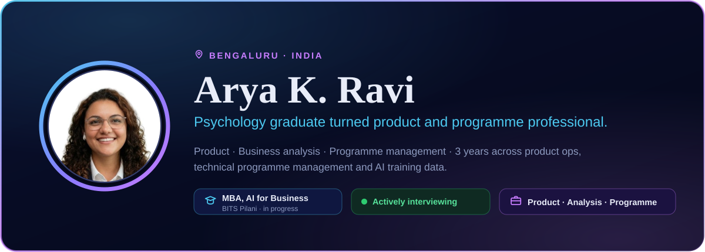
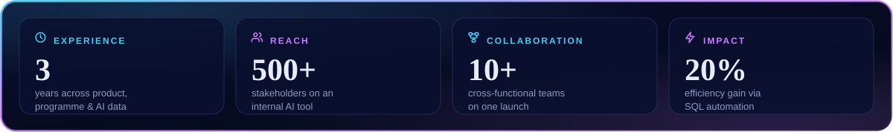
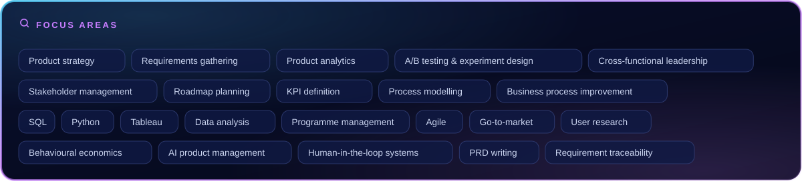
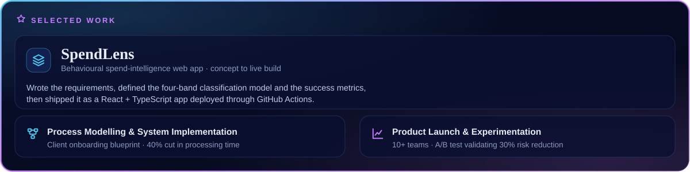
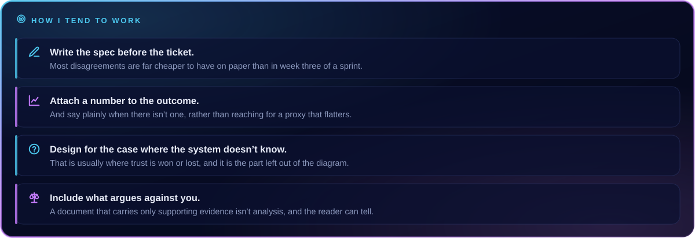

  

  

 

## 👋 About

I work at the point where a loose requirement has to become something a team can actually build — writing the spec, agreeing what the metric is, and staying with it through to what ships. Three years across **product operations**, **technical programme management** and **AI training data**, currently completing an **MBA in AI for Business at BITS Pilani**.

The route here was psychology first, product second, and the first half turns out to matter more than I expected — most of what I do now is about how people behave when a system asks something of them.

> 🟢 **Actively interviewing** — open to **Product Associate**, **Associate Product Manager**, **Product Analyst**, **Business Analyst** and **Associate Program Manager** roles. Bengaluru or remote.

---

## 📄 Resume — pick the role

---

### 🔷 [SpendLens](https://akr246.github.io/spendlens-ai-spend-intelligence/) — behavioural spend-intelligence web app

Took a product from problem statement to a live build: wrote the requirements, defined the four-band classification model and the success metrics, then shipped it as a React / TypeScript app deployed through GitHub Actions.

Six decision engines sit behind it. Two are worth calling out:

- 🎯 **Classification carries a confidence score.** Anything below the threshold goes to a human review queue instead of rendering — a confident wrong answer costs more trust than an honest question, and unlike a missing answer you don't recover from it.
- 🛡️ **A guardrail service sits between the engines and the interface.** It blocks any recommendation touching an essential expense and can overrule every layer beneath it — deliberately separate code, because a guardrail that lives inside the thing it guards isn't a guardrail.

The PRD covers scope, metrics, competitive position — and the published research that argues against the product's own thesis, which turned out to be the most useful section to write.

**[▶️ Live app](https://akr246.github.io/spendlens-ai-spend-intelligence/)** · **[💻 Code](https://github.com/Akr246/spendlens-ai-spend-intelligence)** · **[📖 Case study](https://akr246.github.io/case-studies.html)**

### 🔷 Process Modelling & System Implementation — client onboarding blueprint

Turned business requirements into access-provisioning checklists and milestone-tracking dashboards. Automating the document handling cut processing time by **40%**. → **[Read the case study](https://akr246.github.io/case-studies.html)**

### 🔷 Product Launch & Experimentation — Annalect India

Co-ordinated **10+ cross-functional teams** through a launch, then ran the A/B test that validated a **30% reduction** in the safety risk the feature was built to address. → **[Read the case study](https://akr246.github.io/case-studies.html)**

---

---

## 💼 Experience

| | Role | Where | When | What |
|:---:|:---|:---|:---|:---|
| 🤖 | **AI Trainer** | Alignerr | Apr 2025 – Present | Annotation for orthodontic treatment-planning models |
| 🏷️ | **AI Data Evaluator & Labeling** | TELUS International | 2023, 2024 – 2025 | Training datasets, response evaluation, labelling QA |
| 🗂️ | **Technical Program Manager** | Align Technē | Jul 2024 – Jan 2025 | Azure OpenAI chatbot for 500+ stakeholders, SAP master data migration |
| 🚀 | **Trainee, Talent Transformation** | Annalect India (Omnicom) | Nov 2023 – Jun 2024 | Product launch, A/B testing, Tableau, GTM |
| 📞 | **Sales Operations** | Think & Learn | Jun 2022 – Jun 2023 | Product expert, engagement analysis, lifecycle |

---

## 🧰 Toolkit

 

 

| 🔍 Analysis | 🧩 Product & delivery | 🤖 AI workflows |
|:---|:---|:---|
| SQL · Python · Tableau | Requirements gathering · PRD writing | Labelbox · Scale AI |
| Process & data modelling | Jira · Confluence · Salesforce | SageMaker Ground Truth |
| KPI definition · A/B testing | SOP documentation · Roadmapping | ChatGPT · Claude · Gemini |

---

## 🎓 Education &nbsp;·&nbsp; 🏅 Certifications

<table>
<tr><td width="46%" valign="top">

**Education**

- 🎓 **MBA, AI for Business** BITS Pilani *(in progress)*
- 🧠 **MSc Psychology** St. Agnes Centre for PG Studies & Research
- 📘 **BSc Psychology** Sahrudaya College of Advanced Studies

</td><td width="54%" valign="top">

**Certifications**

- 📈 Google Data Analytics — *Coursera*
- ☁️ Develop GenAI Apps with Gemini & Streamlit — *Google Cloud*
- ☁️ Introduction to Vertex AI Studio — *Google Cloud*
- 🔎 Vector Search and Embeddings — *Google Cloud*
- ⚙️ MLOps for Generative AI — *Google Cloud*
- 🧩 Multimodal RAG with Gemini — *Google Cloud*
- 🧱 Key Technology Foundations for GenAI — *IBM*
- 🗂️ Generative AI Overview for Project Managers — *PMI*
- 🤖 AI & Machine Learning — *Indian Council of Technical Research* (ID AZ2566800)

</td></tr>
</table>

Verify every badge at **[credly.com/users/arya-k-ravi](https://www.credly.com/users/arya-k-ravi)**.

---

## 📊 GitHub

---

## 📫 Get in touch

**[akr24698@gmail.com](mailto:akr24698@gmail.com)** &nbsp;·&nbsp; **[LinkedIn](https://www.linkedin.com/in/akr246)** &nbsp;·&nbsp; **[Portfolio](https://akr246.github.io)** &nbsp;·&nbsp; **[Credly](https://www.credly.com/users/arya-k-ravi)**

Happy to talk about product, analysis, or anything on this page.

📁 Full project index: **[PROJECTS.md](https://github.com/Akr246/Akr246.github.io/blob/main/PROJECTS.md)** &nbsp;·&nbsp; 📖 Deep dives: **[Case studies](https://akr246.github.io/case-studies.html)**

Last updated August 2026

